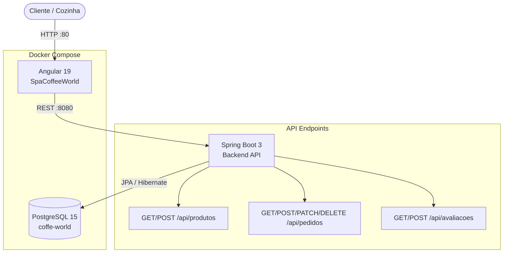
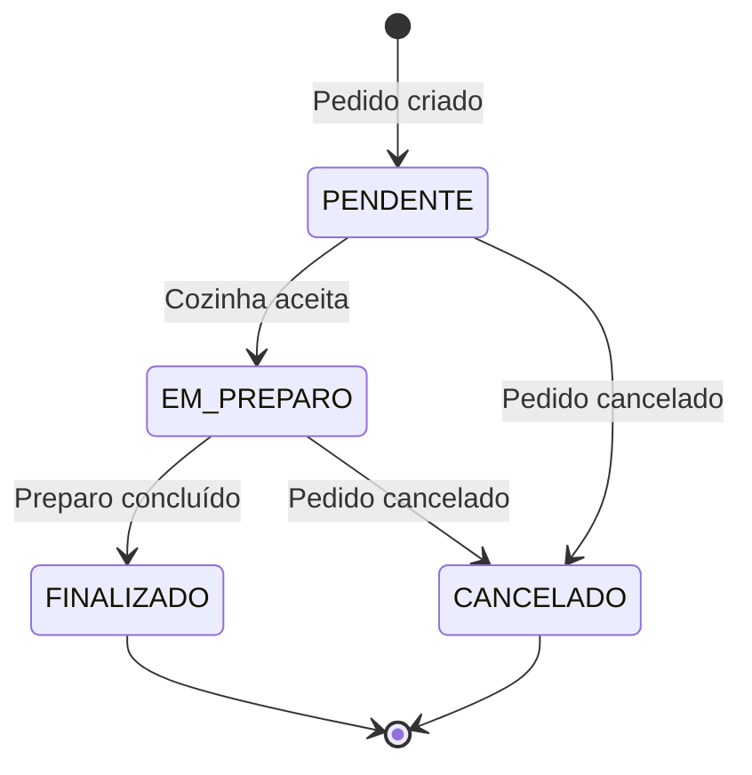

# CoffeeWorld ☕

Sistema completo de pedidos para cafeteria — aplicação full-stack com Angular, Spring Boot e PostgreSQL, totalmente containerizada com Docker.

[](https://angular.dev)
[](https://spring.io/projects/spring-boot)
[](https://openjdk.org/projects/jdk/17/)
[](https://www.postgresql.org/)
[](https://docs.docker.com/compose/)
[](LICENSE)

---

## Sobre o projeto

O CoffeeWorld é um sistema de gestão de pedidos para cafeterias que cobre todo o fluxo: cliente monta o pedido pelo cardápio digital, pedido entra na fila da cozinha com status em tempo real, e a equipe atualiza o andamento até a entrega.

---

## Funcionalidades

- **Cardápio** — listagem de produtos com nome, descrição, preço, categoria e tempo de preparo
- **Carrinho** — montagem e revisão do pedido antes de confirmar
- **Pedidos** — criação, consulta por ID e filtragem por status
- **Painel da Cozinha** — visão dos pedidos em aberto e atualização de status
- **Avaliações** — registro de feedback por pedido

---

## Arquitetura



---

## Fluxo do Pedido



---

## Stack Tecnológica

### Frontend
| Tecnologia | Versão | Uso |
|---|---|---|
| Angular | 19.2.7 | Framework SPA |
| TypeScript | 5.x | Linguagem principal |
| Angular Router | — | Navegação entre views |

### Backend
| Tecnologia | Versão | Uso |
|---|---|---|
| Java | 17 | Linguagem principal |
| Spring Boot | 3.4.5 | Framework web |
| Spring Data JPA | — | Persistência ORM |
| PostgreSQL | 15 | Banco de dados relacional |
| MapStruct | 1.5.5 | Mapeamento DTO ↔ Entity |
| Lombok | 1.18.34 | Redução de boilerplate |
| Springdoc OpenAPI | 2.7.0 | Documentação Swagger |

### Infraestrutura
| Tecnologia | Uso |
|---|---|
| Docker | Containerização |
| Docker Compose | Orquestração dos 3 serviços |

---

## Como Executar

### Pré-requisito
- Docker e Docker Compose instalados

### 1. Clone o repositório
```bash
git clone https://github.com/odavid062/CoffeeWorldPJ.git
cd CoffeeWorldPJ/CoffeeWorldPJ
```

### 2. Suba os serviços
```bash
docker compose up --build
```

| Serviço | URL |
|---|---|
| Frontend (Angular) | http://localhost |
| Backend (API) | http://localhost:8080 |
| Swagger UI | http://localhost:8080/swagger-ui.html |
| PostgreSQL | localhost:5432 |

> Para parar: `docker compose down`  
> Para apagar os dados do banco também: `docker compose down -v`

---

## Endpoints da API

### Produtos
| Método | Rota | Descrição |
|---|---|---|
| `GET` | `/api/produtos` | Lista todos os produtos |
| `POST` | `/api/produtos` | Cadastra novo produto |

### Pedidos
| Método | Rota | Descrição |
|---|---|---|
| `GET` | `/api/pedidos` | Lista todos os pedidos |
| `GET` | `/api/pedidos/{id}` | Busca pedido por ID |
| `GET` | `/api/pedidos/status/{status}` | Filtra por status |
| `POST` | `/api/pedidos` | Cria novo pedido |
| `PATCH` | `/api/pedidos/{id}/status` | Atualiza status do pedido |
| `DELETE` | `/api/pedidos/{id}` | Remove pedido |

### Avaliações
| Método | Rota | Descrição |
|---|---|---|
| `GET` | `/api/avaliacoes` | Lista avaliações |
| `POST` | `/api/avaliacoes` | Registra avaliação |

### Status disponíveis (StatusPedido)
`PENDENTE` → `EM_PREPARO` → `FINALIZADO` / `CANCELADO`

---

## Exemplos de Requisição

### Criar produto
```bash
curl -X POST http://localhost:8080/api/produtos \
  -H "Content-Type: application/json" \
  -d '{
    "nome": "Cappuccino",
    "descricao": "Espresso com leite vaporizado e espuma",
    "preco": 12.90,
    "categoria": "Bebidas",
    "tempoPreparoMinutos": 5,
    "imagemUrl": "https://exemplo.com/cappuccino.jpg"
  }'
```

### Criar pedido
```bash
curl -X POST http://localhost:8080/api/pedidos \
  -H "Content-Type: application/json" \
  -d '{
    "itens": [
      { "produtoId": 1, "quantidade": 2 }
    ]
  }'
```

### Atualizar status (cozinha aceita pedido)
```bash
curl -X PATCH "http://localhost:8080/api/pedidos/1/status?status=EM_PREPARO"
```

---

## Estrutura do Projeto

```
CoffeeWorldPJ/
├── backend/                          # Spring Boot API
│   └── src/main/java/com/coffeworld/backend/
│       ├── dto/                      # Data Transfer Objects
│       ├── enums/
│       │   └── StatusPedido.java     # PENDENTE | EM_PREPARO | FINALIZADO | CANCELADO
│       ├── mapper/                   # MapStruct: Entity ↔ DTO
│       ├── model/
│       │   ├── Produto.java
│       │   ├── Pedido.java
│       │   ├── ItemPedido.java
│       │   └── Avaliacao.java
│       ├── repository/               # Spring Data JPA
│       ├── resource/                 # Controllers REST
│       │   ├── ProdutoResource.java
│       │   ├── PedidoResource.java
│       │   └── AvaliacaoResource.java
│       └── service/                  # Lógica de negócio
├── frontend/                         # Angular 19 SPA
│   └── src/app/
│       ├── components/
│       │   ├── cardapio/             # Listagem de produtos
│       │   ├── carrinho/             # Carrinho de compras
│       │   ├── cozinha/              # Painel da cozinha
│       │   ├── pedido/               # Detalhes do pedido
│       │   └── produto/              # Gestão de produtos
│       ├── models/                   # Interfaces TypeScript
│       └── services/                 # Comunicação com a API
└── docker-compose.yml                # Orquestração dos serviços
```

---

## Documentação Interativa

Após subir a aplicação, acesse o Swagger para testar todos os endpoints diretamente no navegador:

```
http://localhost:8080/swagger-ui.html
```

---

## Autor

**David Rodrigues**  
[](https://github.com/odavid062)

---

## Licença

[MIT](LICENSE)
